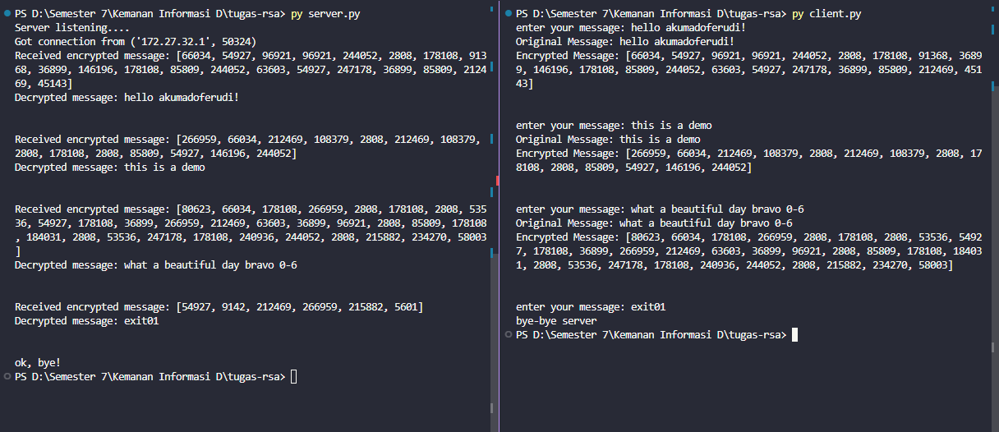

<p align="center">
  <a href="" rel="noopener">
 </a>
</p>

<h3 align="center">Implementation of RSA Algorithm in Socket Programming Python</h3>

<div align="center">

[]()
[](https://github.com/kylelobo/The-Documentation-Compendium/issues)
[](https://github.com/kylelobo/The-Documentation-Compendium/pulls)
[](/LICENSE)

</div>

## How to Run

1. Clone this repository into your local.
2. Go to the clone repository folder.

```
cd ./[your-repo-clone-location]
```

3. Open 2 terminal based on clone folder location.
4. Run server.py in terminal.

```
py server.py
```

5. Run client.py in terminal.

```
py client.py
```

6. Type the message you want in client.py terminal and press enter.
7. Client will encrypt the message and send it to the server while server will receive encrypted message and decrypt it to server's terminal.
8. If you want to exit this program, just type "exit01" in client.py terminal and press enter. The program will exit automatically.

## Demo

<div align="center">
  
</div>
